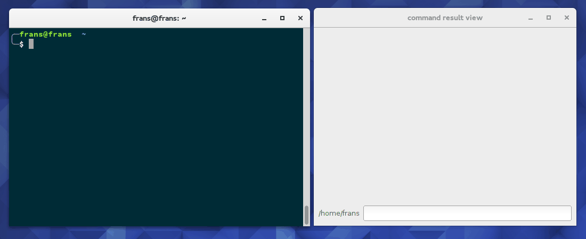

# cmd_result_view
quick view files returned by shell commands

Description
-----------
CRV allows you to quickly look behind file names printed on your terminal
e.g. after firing `find`. Instead of copying a certain file name and
assembling a new command based on `display`, `cat`, `xgd-open`, etc.
you just select the file name and it's content will be immediately
displayed.

Get & Install
-------------

    git clone --recursive https://github.com/frans-fuerst/cmd_result_view.git
    ./cmd_result_view/crv

Todo
----
* Tray based overlay
* Bring to `pip`
* Identify and display more than one file
* support more file types
  - txt
  - pdf
* auto rotate images

Requirements
------------
* Python 2.7+ or Python 3+
* `PyQt4`
* `psutil`

